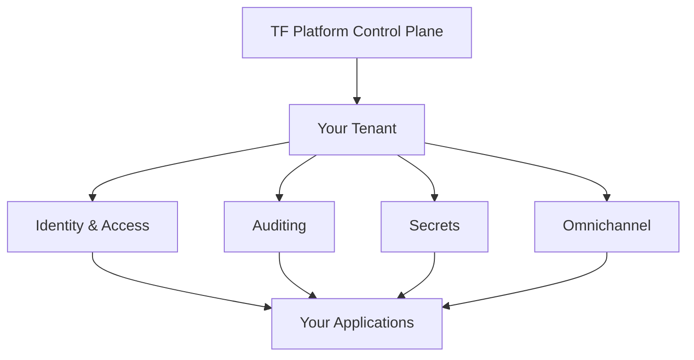

# Overview

### What is TF Platform?

**TF Platform** (short for **The Future Platform**) enables you to quickly set up security infrastructure. This infrastructure includes a suite of essential APIs and tools for managing identity and secrets, authentication, authorization, integrations, audit logging, and user engagement through omnichannel communication.\
\
Our goal is to help teams efficiently manage their critical security infrastructure so they can focus on what matters most: **building, scaling, and innovating their products, platforms, and applications**.

***

### How does TF Platform work?

The following diagram illustrates the basic workflow of TF Platform:

**Control Plane**

The Control Plane is your central hub for setting up & managing product deployments. \
\
&#x20;It provides you with powerful tools to:

* **Tenant Management**: Each deployment is organized into distinct tenants, ensuring secure and efficient management tailored to your specific needs.
* **Operations Management**: The TF Platform Portal is your command center for essential tasks, allowing you to:
  * **User Management**: Easily control user access and permissions, ensuring that the right people have the right access.
  * **Product Deployment**: Launch and manage your applications with just a few clicks, reducing the setup hassle.
  * **Billing and Monitoring**: Gain real-time insights into your usage and costs, helping you make informed decisions.
  * **Maintenance**: Access tools for routine checks and updates, keeping your environment running smoothly.

**Data Plane**

The Data Plane is where the magic happens. This is where crucial service operations take place, including:

* **Authentication and Authorization**: Effortlessly manage user identities and secure access to your applications, ensuring a seamless user experience.
* **Isolated Tenants**: Each deployment operates within its own isolated tenant, providing robust data security and compliance without sacrificing performance.\

***

### Why choose TF Platform?

1. **Simple**: We abstract away the complexities of security infrastructure, allowing you to focus on your core business logic.
2. **Scalable**: Our platform grows with your needs, supporting everything from small startups to large enterprises with the capacity to support millions of end-users.
3. **Quick Deployment**: Get your environment up and running in just 5 minutes, so you can speed up your time-to-market and stay ahead of the competition.
4. **Compliance Made Easy**: Built-in features help you meet GDPR, CCPA, ISO, HIPAA, and SOC standards effortlessly.
5. **Developer-Friendly**: Enjoy easy integrations and clear documentation, enabling your developers from day one.
6. **Free Tier Available:** Start building and testing your ideas without any upfront costs
